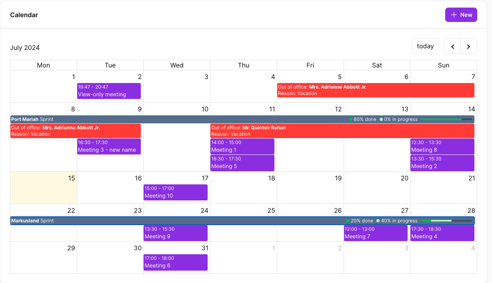
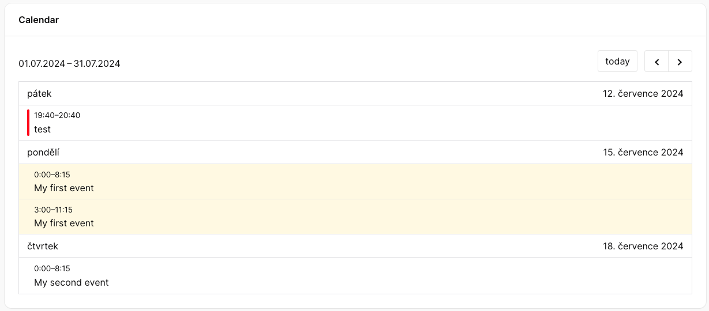
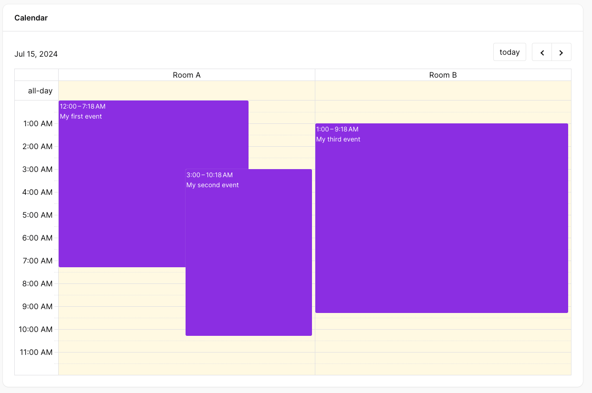

# Adds support for vkurko/calendar to Filament PHP.

[](https://packagist.org/packages/guava/calendar)
[](https://github.com/GuavaCZ/calendar/actions?query=workflow%3Arun-tests+branch%3Amain)
[](https://github.com/GuavaCZ/calendar/actions?query=workflow%3A"Fix+PHP+code+style+issues"+branch%3Amain)
[](https://packagist.org/packages/guava/calendar)

This package adds support for [vkurko/calendar](https://github.com/vkurko/calendar) (free, open-source alternative to FullCalendar) to your FilamentPHP panels.

## Showcase



<video width="320" height="240" controls>
  <source src="https://github.com/GuavaCZ/calendar/raw/main/docs/images/demo_preview.mp4" type="video/mp4">
</video>


https://github.com/user-attachments/assets/a4460084-e8a8-4b1b-9ccd-4d887895155b


## Support us

Your support is key to the continual advancement of our plugin. We appreciate every user who has contributed to our journey so far.

While our plugin is available for all to use, if you are utilizing it for commercial purposes and believe it adds significant value to your business, we kindly ask you to consider supporting us through GitHub Sponsors. This sponsorship will assist us in continuous development and maintenance to keep our plugin robust and up-to-date. Any amount you contribute will greatly help towards reaching our goals. Join us in making this plugin even better and driving further innovation.

## Installation

You can install the package via composer:

```bash
composer require guava/calendar
```

## Usage

# Creating the calendar Widget
First you need to create a custom widget and extend the `CalendarWidget` class. Make sure to remove the `view` property from the generated widget class!

Either use the artisan command or simply create an empty class and extend `CalendarWidget`:
```bash
php artisan filament:make-widget
```

The widget class should look like this:
```php
use \Guava\Calendar\Widgets\CalendarWidget;

class MyCalendarWidget extends CalendarWidget
{
}
```

Add the widget like a regular widget to any filament page you like, such as your `Dashboard`.

## Customizing the calendar view
By default, we show the `dayGridMonth` view. You can customize the view by overriding the `calendarView` property on the widget class:

```php
protected string $calendarView = 'resourceTimeGridWeek';
```

All available views are listed in the [calendar documentation](https://github.com/vkurko/calendar?tab=readme-ov-file#view).

## Adding events
By default, the calendar will be empty. To add events, simply override the `getEvents` method:

```php
public function getEvents(): Collection|array
    {
        return [
            // Chainable object-oriented variant
            Event::make()
                ->title('My first event')
                ->start(today())
                ->end(today()),
                
            // Array variant
            ['title' => 'My second event', 'start' => today()->addDays(3), 'end' => today()->addDays(3)],
            
            // Eloquent model implementing the `Eventable` interface
            MyEvent::find(1),
        ];
    }
```

### Creating events
As shown in the example, there are multiple ways to create events. At the very least, an array object with a `title`, `start` and `end` properties is required.

To help you with creating events, we provide an `Event` ValueObject which contains methods with all available properties an event can have.

This is possible because the `Event` clas implements the `Eventable` interface, which returns the array object. You can add this interface to any class you want which should be treated as an event, such as your eloquent models.

Here is an example:
```php
class Foo extends Model implements Eventable
{
    // ...
    
    public function toEvent(): Event|array {
        return Event::make($this)
            ->title($this->name)
            ->start($this->starts_at)
            ->end($this->ends_at);
    }
}
```

Notice that the model is passed to the `Event` constructor in the `make` method. This sets the `key` and `model` properties to the event object, so it can be used to trigger actions.

### Event object
The event object takes all available options like the underlying calendar package, for more info [read here](https://github.com/vkurko/calendar?tab=readme-ov-file#event-object).

Below is a list of available methods on the event object:

#### Setting the tile
Sets the title of the event that is rendered in the calendar.
```php
Event::make()->title('My event');
```

#### Customizing the start/end date
Sets the start or end date (and time) of the event in the calendar.
```php
Event::make()
    ->start(today())
    ->end(today()->addDays(3));
```

#### Making the event all-day
Sets whether the event is an all-day event or not.
```php
Event::make()->allDay();
```

#### Customizing the background / text color
Sets the background color of the event (by default it is the primary color of the panel).
```php
Event::make()
->backgroundColor('#ff0000')
->textColor('#ffffff');
```

#### Setting the action on click
This sets the action that should be mounted when the event is clicked. It can be any name of a filament action you defined in your widget, such as `edit` or `view`.

By default, all `CalendarWidget` classes already include a `view` and `edit` action.

```php
Event::make()->action('edit');
```

#### Set the model and record key
To mount the action with the correct record, we need to pass the model type and primary key of the record.

The model is also required if you want to display multiple types of events and have each be rendered differently (see customizing event content).

```php
$record = MyModel::find(1);
// 1. variant
Event::make($record);

// 2. variant
Event::make()
    ->model($record::class)
    ->key($record->getKey());
```

#### Passing custom data
You can pass any custom data to the event that you wish:
```php
Event::make()
->extendedProp('foo', 'bar')
// or
->extendedProps(['baz' => 'qux', 'quux' => 'corge']);
```

## Custom Event Content
By default, we use the default view from the calendar package. However, you are able to use your own by overriding the `getEventContent` method on your calendar widget class.

Due to the nature of the calendar package, it currently is not possible to pass blade parameters to the view. However, each view is wrapped in an alpine component, which has access to the event data. You can use any alpine functionality to display the data any way you seem fit.

If you only have one type of events or events that render the same way, you can simply return a view or a HtmlString from the getEventContent method:

```php
public function getEventContent(): null|string|array
{
    // return a blade view
    return view('calendar.event');
    
    // return a HtmlString
    return new HtmlString('<div>My event</div>');
}
```

Example of the `calendar.event` view blade file: 
```bladehtml
<div class="flex flex-col items-start">
    <span x-text="event.title"></span>
    <template x-for="user in event.extendedProps.users">
        <span x-text="user.name"></span>
    </template>
</div>
```

If you want to render events differently based on their model type, you can return an array like so:
```php
public function getEventContent(): null|string|array
{
    return [
        MyModel::class => view('calendar.my-model-event'),
        AnotherModel::class => view('calendar.another-model-event'),
    ];
}
```

## Customize the form schema
When an event triggers an action (such as view or edit actions), a modal with a form is opened.

You can customize the form schema by overriding the `getSchema` method in your widget class:

```php
public function getSchema(?string $model = null): ?array
{
    // If you only work with one model type, you can ignore the $model parameter and simply return a schema
    return [
        TextInput::make('title')
    ];
    
    // If you have multiple model types on your calendar, you can return different schemas based on the $model property
    return match($model) {
        Foo::class => [
            TextInput::make('name'),
        ],
        Bar::class => [
            TextInput::make('title'),
            TextArea::make('description'),
        ],
    }
}
```

## Resources
Resource views (their names start with `resource`) allow you to group events into resources (such as rooms, projects, etc.).

To use resource views, you need to create resources and assign your events to these resources.




### Creating resources
To create resources, you need to override the `getResources` method on your calendar widget class. Just like events, there are three options you can choose from to create resources:

```php
public function getResources(): Collection|array
{
    return [
        // Chainable object-oriented variant
        Resource::make('foo')
            ->title('Room 1'),
            
        // Array variant
        ['id' => 'bar', 'title' => 'Room 2'],
        
        // Eloquent model implementing the `Resourceable` interface
        MyRoom::find(1),
    ];
}
```

## Handling events
### Click event
by default, a click event fires the `view` action.

You can set the default click action by overriding the `defaultEventClickAction` property of the widget:

```php
protected ?string $defaultEventClickAction = 'edit';
```

If you want to handle the event click logic completely by yourself, you may override the `onEventClick` method:

```php
public function onEventClick($info): void
{
    // do something on click
    // $info contains the event data
}
```

## Context menu
Optionally you can add a context menu to your calendar, which allows you to create events by clicking on a date cell or by selecting a date/time range by dragging.

To enable the context menu, all you need to do is implement the `getContextMenuActions` method:

For example:
```php
public function getContextMenuActions(): array
{
    CreateAction::make('foo')
        ->model(Foo::class)
        ->mountUsing(fn ($arguments, $form) => $form->fill([
            'starts_at' => data_get($arguments, 'startStr') ?? data_get($arguments, 'dateStr'),
            'ends_at' => data_get($arguments, 'endStr') ?? data_get($arguments, 'dateStr'),
        ])),
}
```

The mount using function is used to fill the form with the arguments from the calendar. It contains all information that vkurko/calendar provides in the `select` and `dateClick` events, but most importantly:
- `startStr` and `endStr` for range selection
- `dateStr` for date clicks

<video width="320" height="240" controls>
  <source src="https://github.com/GuavaCZ/calendar/raw/main/docs/images/context_menu_preview.mp4" type="video/mp4">
</video>

https://github.com/user-attachments/assets/a2641b40-9cbd-4c40-b360-7621caa86c40


## Troubleshooting
### Context menu actions don't work
If you encounter issues with the context menu, either that the actions don't mount correctly or that the arguments array is empty, make sure that the name of the action is unique across the whole widget. If there is another action with the same name, it might be mounted instead of the one you want.

## Authorization
Due to security reasons, actions use Laravel's default authorization mechanism to check if user is allowed to perform actions.

This means that most likely your actions might not work when you add them (such as view or edit actions on event click). If that's the case, please create a policy for your model and add the necessary checks to the policy.

## Testing

```bash
composer test
```

## Changelog

Please see [CHANGELOG](CHANGELOG.md) for more information on what has changed recently.

## Contributing

Please see [CONTRIBUTING](CONTRIBUTING.md) for details.

## Security Vulnerabilities

Please review [our security policy](../../security/policy) on how to report security vulnerabilities.

## Credits
- [Lukas Frey](https://github.com/GuavaCZ)
- [All Contributors](../../contributors)
- Spatie - Our package calendar is a modified version of [Spatie's Package Calendar](https://github.com/spatie/package-calendar-laravel)
- [vkurko/calendar](https://github.com/vkurko/calendar) - free, open-source alternative to FullCalendar
- [saade/filament-fullcalendar](https://github.com/saade/filament-fullcalendar) - heavy inspiration for this package

## License

The MIT License (MIT). Please see [License File](LICENSE.md) for more information.
