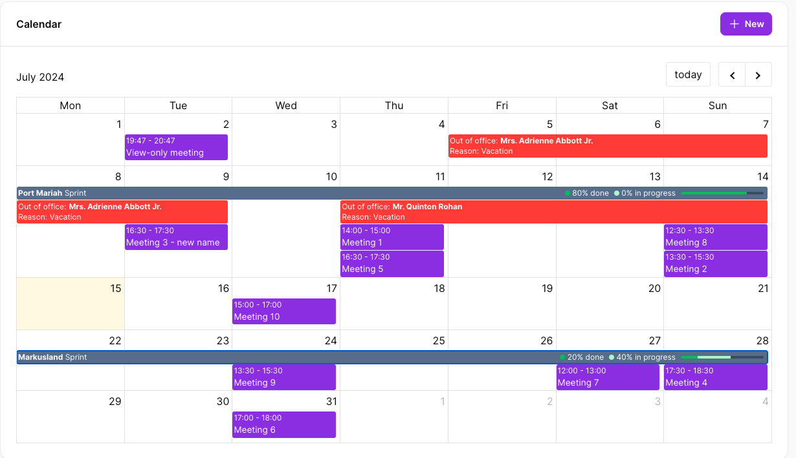
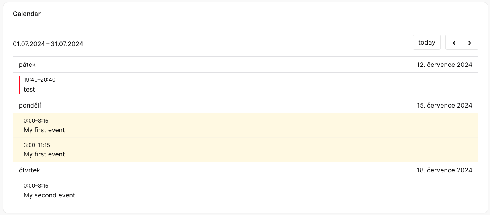

# Introduction

Calendar adds a calendar widget to your filament panels, powered by [vkurko/calendar](https://github.com/vkurko/calendar), a free and open-source alternative to FullCalendar.

You can display events from as many models as you like, and even group them into resources. For example, you could have lessons (events) that are held in different rooms (resources).

The calendar is a regular filament widget, so you create one by extending our class:

```php
use Guava\Calendar\Filament\CalendarWidget;

class MyCalendarWidget extends CalendarWidget
{
}
```

From there you tell it which events to show, and optionally enable the interactions you need: clicking events to open modals, dragging them to new dates, creating events through context menus and more.





## Version compatibility

| Filament version | Plugin version |
|------------------|:--------------:|
| 3.x              |      1.x       |
| 4.x              |      2.x       |
| 5.x              |      3.x       |

For older filament versions, please check the branch of the respective version.
