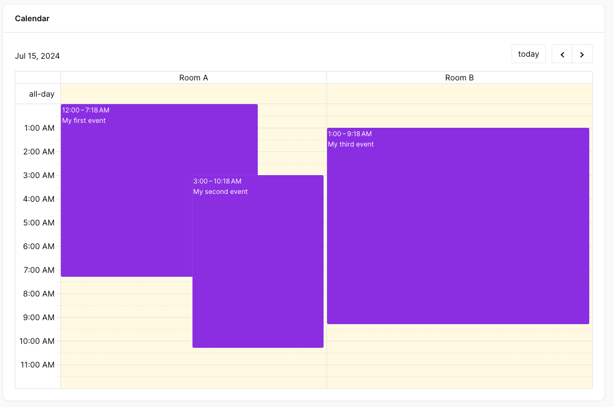

# Resources

Resources let you group your events into rows or columns, for example lessons (events) that are held in different rooms (resources).

They only appear in the `Resource*` [calendar views](../widget/02-calendar-views.md), so make sure your widget uses one of them.

